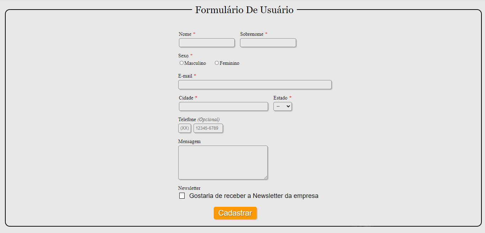
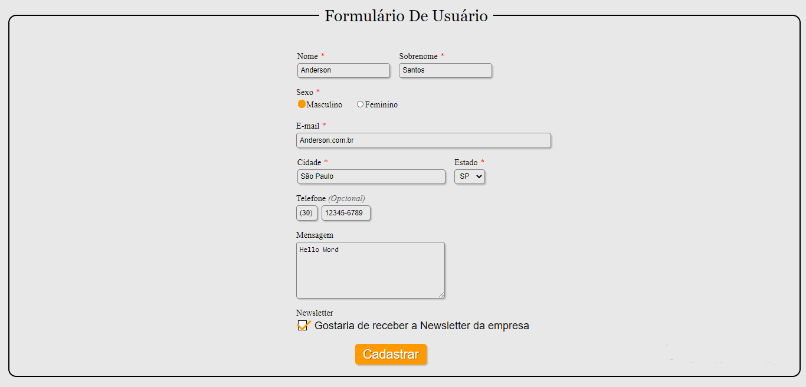

<h1 align="center"><b>Formulário De Usuário</h1>

___

___

## 📋**Sobre**

#1Primeiro Projeto No Github.

Um formulário de usuário simples para cadastro.
___

## **💻Tecnologias Usadas**
- ### Html
- ### Css
- ## 💻🎧🍕
---

## 📝Licença
Consulte a [LICENÇA](https://github.com/AAndersonSantos/Form/blob/main/LICENSE) para obter mais informações.

---

<h3 align="center"><b>Feito por 😎Anderson Santos.
</h3>